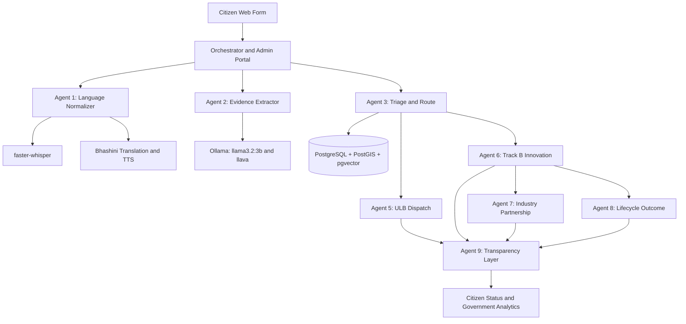

# SAHYOG: Intelligent Civic Grievance and Outcome Platform

## Executive Summary

SAHYOG is a multilingual, AI-assisted civic grievance platform. Citizens can submit a complaint using text, voice, a photograph, and a location. The platform normalizes the report, extracts evidence, detects duplicates, calculates priority, routes the case to a municipal department or research institution, and exposes progress to operators and citizens.

The core principle is **AI assisting, humans deciding**. Artificial intelligence suggests classification and routing, but a human operator validates the final decision.

## Problem

Civic complaints are often fragmented, unclear, duplicated, poorly located, and difficult to track after submission. Municipal teams may receive many reports about the same problem, while complex cases may not reach the right research or innovation institution.

## Solution

SAHYOG connects the complete journey:

```text
Citizen report
  -> language and PII normalization
  -> text, image, and location evidence extraction
  -> geospatial and semantic duplicate detection
  -> priority calculation
  -> human validation
  -> Track A municipal dispatch or Track B innovation matching
  -> outcome, lifecycle, and transparency tracking
```

## Architecture



## Complete Technology Stack

| Layer | Technology |
|---|---|
| Programming language | Python 3.11 |
| API framework | FastAPI |
| Application server | Uvicorn |
| Data validation | Pydantic |
| Database | PostgreSQL 16 |
| Spatial processing | PostGIS |
| Vector search | pgvector |
| ORM and database access | SQLAlchemy and Psycopg2 |
| Speech recognition | faster-whisper |
| Translation and speech | Bhashini |
| Local text AI | Ollama llama3.2:3b |
| Local vision AI | Ollama llava |
| Embeddings | all-MiniLM-L6-v2 |
| Image processing | Pillow |
| Geocoding | OpenStreetMap Nominatim |
| Frontend | HTML, CSS, JavaScript |
| Containers | Docker and Docker Compose |
| Testing | Pytest |
| HTTP clients | HTTPX and Requests |

## Services and Ports

| Service | Directory | Port | Main responsibility |
|---|---|---:|---|
| Agent 1 | `1.Language normalizer` | 8001 | ASR, translation, PII scrubbing, TTS |
| Agent 2 | `2.Evidence Extractor` | 8002 | Text, image, and GPS evidence |
| Agent 3 | `3.Triage and route` | 8003 | Deduplication, priority, validation |
| Agent 5 | `5.ULB Dispatch` | 8004 | Municipal routing, SLA, closure |
| Orchestrator | `4.Orchestrator` | 8005 | Citizen UI, coordination, admin portal |
| Agent 6 | `6.Track B Innovation` | 8006 | HEI matching, teams, proposals |
| Agent 7 | `7.Industry Partnership` | 8007 | Partner matching and funding records |
| Agent 8 | `8.Lifecycle Outcome` | 8008 | Milestones, pilots, handover, spin-outs |
| Agent 9 | `9.Transparency Layer` | 8009 | Audit, analytics, citizen status |

Port `8005` is the current orchestrator port because port `8000` is occupied by another process on the development machine.

## Agent 1: Language Normalizer

Agent 1 accepts text or audio and provides:

- Speech-to-text using local faster-whisper
- Automatic language detection
- Bhashini translation for supported languages
- PII scrubbing for phone and Aadhaar-like identifiers
- Confidence scoring and human-review status
- Bhashini text-to-speech responses

Important endpoints:

```text
GET  /health
POST /api/v1/webhook
POST /api/v1/audio/upload
POST /api/v1/speak
```

## Agent 2: Evidence Extractor

Agent 2 converts unstructured reports into structured evidence:

- English-normalized complaint
- Civic domain
- Severity
- Entities and locations
- Actionability
- Suggested Track A or Track B
- Image consistency
- EXIF GPS information
- Human-review requirement

It uses `llama3.2:3b` for text extraction and `llava` for image analysis.

```text
POST /evidence/extract
POST /evidence/attach-photo
```

## Agent 3: Triage and Route

Agent 3 stores tickets in PostgreSQL. It uses PostGIS for nearby-ticket searches and pgvector for semantic similarity.

Responsibilities:

- Detect nearby duplicate reports
- Compare complaint meaning with embeddings
- Merge duplicate reports into clusters
- Calculate priority scores
- Provide the DNO operator queue
- Persist operator decisions

```text
POST /d2/ingest
POST /g1/recalculate/{ticket_id}
POST /g1/recalculate
GET  /dno/tickets
GET  /dno/tickets/{ticket_id}
POST /dno/tickets/{ticket_id}/decision
```

Priority formula:

```text
priority = severity * weight
         + cluster_count * weight
         + age_in_hours * weight
         + population_impact * weight
```

## Orchestrator and Citizen Workflow

The Orchestrator coordinates the first three agents and serves the frontend.

```text
describe
  -> confirm or correct
  -> upload photo
  -> provide GPS or typed location if needed
  -> finalize
  -> create ticket
```

Useful URLs:

```text
http://127.0.0.1:8005/
http://127.0.0.1:8005/dashboard
http://127.0.0.1:8005/admin
```

## Track A: ULB Dispatch

Track A handles problems that existing municipal departments can solve:

- Roads and potholes
- Water supply
- Garbage collection
- Drainage
- Electricity
- Streetlights
- Public facilities
- Traffic signage

Workflow:

```text
Validated ticket
  -> ULB and department selection
  -> API or email dispatch
  -> officer status link
  -> acknowledgement and SLA monitoring
  -> closure photograph and location verification
  -> resolved or manual review
```

The service supports retry logic, API-to-email fallback, correlation codes, escalation, reconciliation, officer status links, and closure evidence.

## Track B: Innovation and HEI Matching

Track B handles complex cases requiring research or specialist expertise:

- Unknown structural failure
- Agricultural disease
- Complex engineering problems
- Research-oriented civic challenges
- Some illegal construction or encroachment cases

Workflow:

```text
Track B decision
  -> semantic HEI capability matching
  -> HEI accepts or declines
  -> decline reroutes to next match
  -> team formation
  -> proposal submission
  -> nodal officer review
```

An approved proposal can trigger Industry Partnership and Lifecycle Outcome.

## Industry Partnership

Industry Partnership connects approved research proposals with companies, startups, MSMEs, CSR organizations, and laboratories.

It records:

- Partner matching
- Partner acceptance or decline
- IP ownership tier
- Milestone funding commitments
- Fund releases
- NEP academic credit or CSR certificate records

These are workflow and audit records. The current MVP does not transfer real money, sign legal agreements, or issue externally recognized certificates.

## Lifecycle Outcome

Lifecycle Outcome manages the post-approval project journey:

- Kickoff, midpoint, and final milestones
- Evaluator scores
- Pilot validation
- Geographic and optional visual checks
- Handover to ULB or Panchayat
- Startup or incubation spin-out

A successful pilot does not automatically trigger handover or spin-out. A human must select the disposition.

## Transparency Layer

The Transparency Layer provides:

- Government analytics
- District and domain aggregates
- HEI participation statistics
- Industry engagement statistics
- Pilot completion rates
- Handover and spin-out outcomes
- Citizen ticket status
- Append-only audit events

```text
http://127.0.0.1:8009/transparency/dashboard
http://127.0.0.1:8009/transparency/dashboard.json
http://127.0.0.1:8009/status/{ticket_id}
http://127.0.0.1:8009/status/{ticket_id}.json
```

## Database Architecture

All services share the PostgreSQL database `dno_triage` on port `5432`.

Core extensions:

```sql
CREATE EXTENSION postgis;
CREATE EXTENSION vector;
```

Important table groups include:

```text
active_tickets, validation_decisions, cold_storage
ulb_directory, ulb_contacts, dispatches, dispatch_events, closure_proofs
hei_registry, hei_capabilities, hei_matches, teams, proposals
partners, partner_capabilities, partnership_matches
milestone_fund_ledger, fund_releases, milestones, pilot_validations
handover_records, spinout_records, audit_log
```

## Installation

Prerequisites:

- Python 3.11
- Docker Desktop with Linux containers
- FFmpeg on PATH
- Internet access for initial package and model downloads
- Bhashini credentials for translation and speech

Create the virtual environments:

```powershell
$services = @(
  "1.Language normalizer", "2.Evidence Extractor", "3.Triage and route",
  "4.Orchestrator", "5.ULB Dispatch", "6.Track B Innovation",
  "7.Industry Partnership", "8.Lifecycle Outcome", "9.Transparency Layer"
)
foreach ($dir in $services) {
  Push-Location $dir
  python -m venv .venv
  .venv\Scripts\python.exe -m pip install -r requirements.txt
  Pop-Location
}
```

Start infrastructure:

```powershell
docker start ollama
docker start agent-d-postgres
docker exec ollama ollama list
```

Required Ollama models:

```text
llama3.2:3b
llava
```

Apply database migrations in dependency order, beginning with Agent 3 and ending with the Transparency Layer. Then start the entire system:

```powershell
python start_pipeline.py
```

Combined logs are written to:

```text
logs/sahyog.log
```

## Demonstration Examples

### Track A example

```text
There is a large pothole near the central market in Ranchi.
```

Expected route:

```text
Track A -> ULB dispatch -> officer status -> closure verification
```

### Track B example

```text
An illegal building extension is blocking the public footpath near the central market in Ranchi.
```

Expected route:

```text
Track B -> HEI match -> team -> proposal -> nodal approval
```

## Security

Never commit `.env` files or expose their contents in screenshots, chat, logs, or issue reports. Any credential shared outside the project must be revoked and replaced.

Security mechanisms currently include:

- HTTP Basic authentication for human admin actions
- Internal service tokens for service-to-service calls
- Expiring URL tokens for officer, HEI, and partner workflows
- Image file-signature validation
- PII scrubbing
- Append-only audit behavior

Before production deployment, add HTTPS, a secrets manager, database roles, firewall restrictions for internal routes, centralized authentication, rate limiting, request limits, and cryptographically verifiable audit logs.

## Known Limitations

- Conversation sessions are in memory and are lost after orchestrator restart.
- Database migrations are manual.
- Demo ULB, HEI, and partner records are not real institutional directories.
- ULB API payloads are generic placeholders.
- Email can run in dry-run mode.
- Industry funding and academic records are not real external transactions.
- No SMS or WhatsApp delivery is implemented.
- Audit logs are application-append-only, not cryptographically immutable.
- Public Nominatim geocoding is rate-limited.
- Some regional and tribal languages require human transcription.
- Fire-and-forget webhooks require reconciliation endpoints.
- The platform is a hackathon/demo system, not a production government deployment.

## Testing

Each service has its own tests and virtual environment. Run tests from the relevant service directory:

```powershell
pytest -q
```

The test suites cover evidence processing, geolocation, semantic matching, routing, idempotency, SLA calculations, closure validation, funding limits, lifecycle decisions, audit behavior, and transparency aggregation.

## Presentation Summary

### Problem

Citizens submit complaints through disconnected channels. Reports may be unclear, duplicated, misrouted, or impossible to track.

### Solution

SAHYOG turns multimodal citizen reports into validated, prioritized, traceable cases that can move through government or research workflows.

### Innovation

- Multilingual voice interaction
- Local AI inference
- Image and location evidence validation
- Geospatial and semantic deduplication
- Human-in-the-loop routing
- HEI and industry collaboration
- Lifecycle outcome tracking
- Citizen status visibility
- Government transparency analytics

### Final Project Statement

> SAHYOG is a multilingual, AI-assisted civic grievance and outcome platform that validates citizen evidence, removes duplicate complaints, routes cases to government or research institutions, tracks real-world outcomes, and makes progress visible to citizens and administrators.
